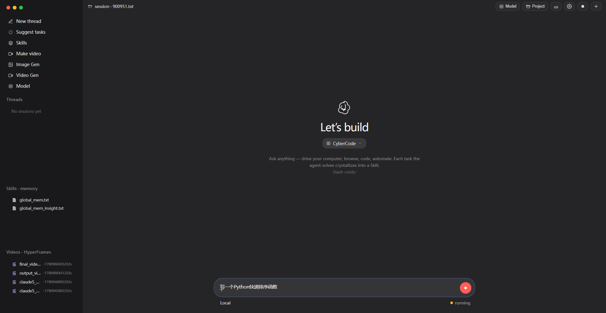
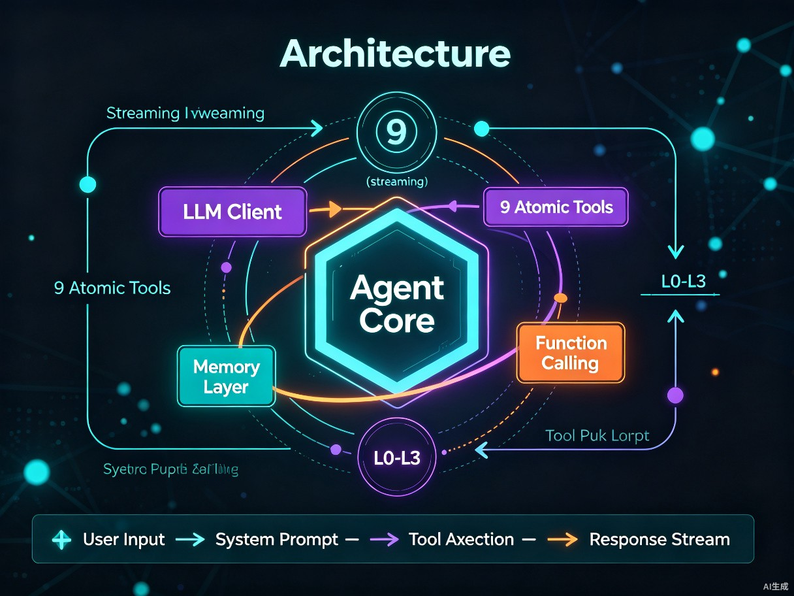
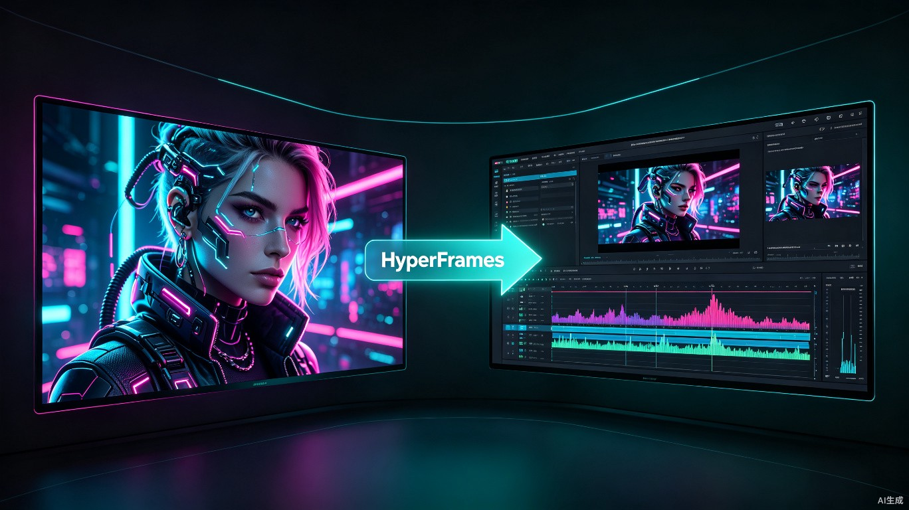
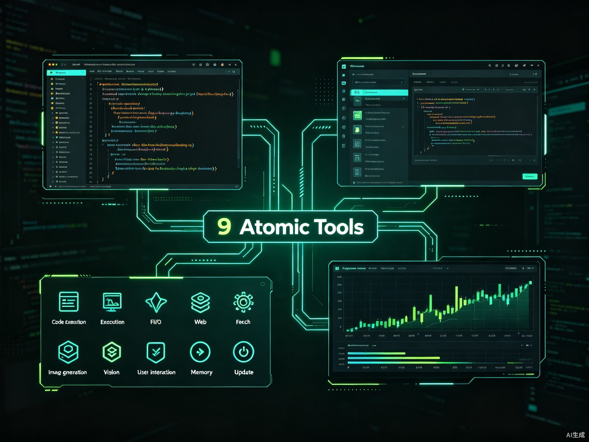

<div align="center">

# CyberCode

### The All-in-One AI Agent Platform — Free GPT-5.5, Claude Opus 4.8 & GLM-5.2

[](https://opensource.org/licenses/MIT)
[](https://www.python.org/downloads/)
[](#)
[](#)

**A self-contained, physical-level AI Agent — directly drives frontier LLMs with 9 built-in system tools that read/write files, execute code, scan the web, and generate images & videos.**

[中文文档](README_CN.md)

</div>

---

## What is CyberCode

CyberCode is an AI Agent that runs in your local browser. It's not a chatbot shell — it's a **doer with hands and feet** that can actually operate your file system, run scripts, access the network, and generate multimedia content.

The key point: **use GPT-5.5, Claude Opus 4.8, GLM-5.2, Gemini 3.1 Pro, DeepSeek V4 and 32+ frontier models for free**, plus free gpt-image-2 image generation and Nanobanana video generation. All models are proxied through a unified gateway with sanitized error logs — frontend users never see any upstream infrastructure details.

<div align="center">

<p><sub>CyberCode Web UI — Codex-dark theme, model selector on the left, skills panel on the right</sub></p>
</div>

---

## Core Capabilities

| Capability | Details |
|------------|---------|
| **Free Frontier Models** | GPT-5.5 / Claude Opus 4.8 / GLM-5.2 / Gemini 3.1 Pro / DeepSeek V4 Flash and 32+ models |
| **Free Image Generation** | gpt-image-2 (1024x1024 / portrait / landscape), text-to-image and image editing |
| **Free Video Generation** | Nanobanana model + HyperFrames HTML rendering engine, with edge-tts narration |
| **9 Atomic Tools** | Code execution / File read-write / Web scraping / JS execution / Image gen / Vision / User interaction / Memory |
| **Function Calling** | OpenAI tools-compatible function calling, streaming and non-streaming |
| **3-Level Memory** | L0 meta-rules / L1 insight index / L2 stable facts / L3 task SOPs |
| **Self-Contained** | Only Python stdlib + requests needed, no LangChain / Playwright / browser binary deps |

---

## Why CyberCode

Most AI clients on the market are either pure chat boxes (no execution capability) or heavy frameworks (depending on a pile of Node modules and browser kernels). CyberCode takes a different path:

**Keep the Agent thin, make the models thick.** The core is only about 1,300 lines of Python, but it connects to 30+ frontier models through a unified OpenAI-compatible interface. You write a requirement, it decides which tools to call, which files to read, which code to run — the whole process streams in real time, you watch it work.

<div align="center">

<p><sub>Architecture: Agent Core orchestrates, LLM Client streams, 9 tools each serve their purpose</sub></p>
</div>

---

## 32+ Built-in Frontier Models

All models are proxied through a unified gateway — switching models takes a single API call. Partial model list:

### Conversation & Reasoning Models

| Model | Family | Notes |
|-------|--------|-------|
| `gpt-5.5` | OpenAI GPT | Flagship conversational model |
| `gpt-5.4` | OpenAI GPT | High cost-efficiency |
| `gpt-5-mini` | OpenAI GPT | Lightweight & fast |
| `gpt-5.3-codex` | OpenAI Codex | Code-specialized |
| `gpt-4.1` | OpenAI GPT | Classic & stable |
| `claude-opus-4-8` | Anthropic Claude | Top-tier reasoning |
| `claude-opus-4-7` | Anthropic Claude | Long-context analysis |
| `gemini-3.1-pro-preview` | Google Gemini | Multimodal |
| `gemini-3.5-flash` | Google Gemini | Ultra-fast response |
| `deepseek-v4-flash` | DeepSeek | Top-tier domestic |
| `deepseek-v4-pro` | DeepSeek | Deep reasoning |
| `deepseek-r1-14b` | DeepSeek R1 | Reasoning chain |
| `glm-5.2` | Zhipu GLM | **Free tier, FC support** |
| `free/glm-5.2` | Zhipu GLM | **Default model, zero cost** |
| `kimi-k2.7` | Moonshot Kimi | Ultra-long context |
| `minimax-m3` | MiniMax | Strong general baseline |
| `qwen-2.5-coder-14b` | Alibaba Qwen | Code generation |
| `llama-3.1-8b` | Meta Llama | Open-source standard |
| `mistral-small-24b` | Mistral | European flagship |

### Multimedia Generation Models

| Model | Use Case | Method |
|-------|----------|--------|
| `gpt-image-2` | Text-to-image / Image-to-image | Async creation-tasks API |
| `codex-gpt-image-2` | Image editing | image-edits endpoint |
| `nanobanana` | Video generation | HyperFrames + ffmpeg pipeline |
| `hy-mt1` | Multimodal understanding | Visual Q&A |

<div align="center">

<p><sub>Image generation & video creation — AI image gen on the left, HyperFrames timeline on the right</sub></p>
</div>

---

## 9 Atomic Tools

The Agent works not by "chatting" but by **calling tools to complete tasks**. CyberCode has 9 physical-level tools covering all aspects of system operation:

<div align="center">

</div>

| Tool | Capability | Example |
|------|-----------|---------|
| `tool_code_run` | Execute Python / Bash / Shell scripts | Run data analysis, install deps, call system commands |
| `tool_file_read` | Read any text file, with line numbers and ranges | Check logs, read source, view config |
| `tool_file_write` | Overwrite / append / prepend file content | Generate code, write reports, edit config |
| `tool_file_patch` | Precise search-and-replace file fragments | Fix bugs, refactor functions |
| `tool_web_scan` | Scrape web pages and extract body text | Read docs, crawl data, look up info |
| `tool_web_execute_js` | Run JavaScript in the browser | Automate operations, extract dynamic content |
| `tool_generate_image` | Generate images via gpt-image-2 | Illustrations, UI mockups, artwork |
| `tool_view_image` | Visually understand image content | Read screenshots to find bugs, describe scenes |
| `tool_ask_user` | Ask the user questions and wait for answers | Clarify requirements, confirm risky operations |

Additionally, two memory tools: `update_working_checkpoint` (short-term notes) and `start_long_term_update` (long-term experience), keeping the Agent on track during long tasks and smarter on repeated ones.

---

## HyperFrames Video Engine

CyberCode includes the HyperFrames skill set — a framework for **rendering video with HTML**. You describe what video you want, the Agent automatically writes HTML compositions (with `data-*` timing attributes), then uses GSAP / Lottie / Three.js for animation, and finally ffmpeg composites an MP4 with audio.

```
User: "Make a 10-second cat science video with narration"
  ↓
Agent decision path:
  1. Call gpt-image-2 to generate 3 scene images
  2. Call edge-tts to synthesize narration MP3
  3. Write HyperFrames HTML composition (GSAP timeline + fade in/out)
  4. ffmpeg composites H.264 1920x1080 + AAC audio
  5. Self-check: duration, resolution, audio presence → 100/100
  ↓
Output: cat_video_final.mp4
```

HyperFrames includes 7 domain skills, loaded on demand:

| Skill | Purpose |
|-------|---------|
| `hyperframes-core` | HTML composition author contract (`data-*` attrs, clips, tracks) |
| `hyperframes-animation` | Atomic animations (GSAP / Lottie / Three.js / CSS / WAAPI) |
| `hyperframes-creative` | Creative direction (color, typography, narration, beat) |
| `hyperframes-media` | TTS voiceover, background music, subtitles, bg removal |
| `hyperframes-cli` | Dev loop (init / lint / render / publish) |
| `hyperframes-registry` | Registry component installation |
| `general-video` | General video workflow routing |

---

## Quick Start

### Option 1: npm One-Click Install (Recommended)

```bash
npm install -g cybercode-cli
```

After installation, type in your terminal:

```bash
cybercode web
```

The terminal will display the local service address — open it in your browser to see the CyberCode interface. **No configuration needed** — model keys, gateway addresses, and default parameters are all auto-configured out of the box.

### Option 2: Clone the Repository

```bash
git clone https://github.com/ciouskeila-hue/cybercode-cli.git
cd cybercode-cli
python python/cybercodewebui.py
```

Also requires no manual configuration — after launch, visit `http://localhost:18600` in your browser.

### Getting Started

After opening the browser, you'll see a login screen. **Register or log in to your CyberCode account** to enter the main interface — all models (GPT-5.5, Claude Opus 4.8, GLM-5.2, and 32+ frontier models) are immediately available, along with image and video generation.

After logging in, `free/glm-5.2` (zero-cost model) is selected by default. You can switch to any other model in the left-side model selector at any time. Just type your request in the input box and the Agent will automatically call tools to complete the task.

> **Zero-config philosophy**: CyberCode handles all underlying configuration at startup — model routing, key management, and token generation all happen in the background. As a user, you just log in and let the system handle the rest.

---

## API Reference

CyberCode exposes a clean HTTP API for integration with other systems:

| Method | Endpoint | Description |
|--------|----------|-------------|
| `GET` | `/` | Web UI page |
| `GET` | `/api/status` | Running status + current model |
| `GET` | `/api/sessions` | Conversation history list |
| `GET` | `/api/skills` | Skill document list |
| `GET` | `/api/messages?path=` | Replay a session |
| `GET` | `/api/videos` | Rendered MP4 list |
| `GET` | `/api/video/<relpath>` | Video stream (Range support) |
| `POST` | `/api/chat` | Send message, SSE streaming response |
| `POST` | `/api/chat` (video:true) | Video mode, injects HyperFrames preamble |
| `POST` | `/api/llm` | Switch LLM |
| `POST` | `/api/stop` | Abort current task |
| `POST` | `/api/new` | Start new session |
| `POST` | `/api/continue` | Restore historical session |

---

## Tech Stack & Acknowledgments

CyberCode's Agent core architecture (agent loop structure, 9-tool design, memory hierarchy philosophy, system prompt approach) is derived from the **GenericAgent** project, open-sourced by lsdefine under the MIT License:

- **GenericAgent** — [github.com/lsdefine/GenericAgent](https://github.com/lsdefine/GenericAgent) © 2025 lsdefine

Built on top of this, CyberCode adds:

- Rewritten LLM Client with OpenAI-compatible streaming + function calling
- Unified gateway proxy layer (model routing + session tokens + error sanitization)
- HyperFrames video engine integration (HTML → ffmpeg pipeline)
- edge-tts voice synthesis (auto-install logic built into system prompt)
- Codex-dark themed Web UI (i18n Chinese/English)
- Zero-config auto-deployment (`cybercode web` after npm install)

### Dependencies

| Dependency | Purpose | Required? |
|------------|---------|-----------|
| `requests` | HTTP requests | Yes |
| `ffmpeg` | Video compositing | Video mode only |
| `edge-tts` | Voice synthesis | Video narration only |
| Python stdlib | Everything else | Built-in |

---

## Project Structure

```
cybercode/
├── agent_core.py            # Agent core: LLM Client + 9 tools + agent loop
├── cybercodewebui.py        # Web server: HTTP API + SSE streaming + proxy layer
├── cybercodewebui.html      # Frontend: Codex-dark UI + i18n + real-time chat
├── mykey.json               # Model config (auto-generated, not in repo)
├── custom_system_prompt.txt # Custom system prompt (hot-reload)
├── .auth_token              # Auto-generated token (not in repo)
├── skills/                  # 14 skill documents
│   ├── hyperframes.md       # Video engine entry
│   ├── hyperframes-core.md  # HTML composition contract
│   ├── hyperframes-animation.md
│   ├── hyperframes-creative.md
│   ├── hyperframes-media.md
│   ├── hyperframes-cli.md
│   ├── hyperframes-registry.md
│   ├── image-gen.md         # Image generation API
│   ├── edge-tts-tts.md      # Voice synthesis
│   ├── general-video.md     # General video routing
│   ├── motion-graphics.md
│   ├── product-launch-video.md
│   ├── website-to-video.md
│   └── faceless-explainer.md
├── memory/                  # 3-level memory system
│   ├── global_mem.txt       # L2 stable facts
│   └── global_mem_insight.txt # L1 insight index
├── temp/                    # Working directory (gitignored)
├── docs/
│   └── images/              # README demo images
└── .gitignore
```

---

## Usage Examples

### Example 1: Write and Execute a Script

```
User: Write a Python script that counts lines in all .py files in the current directory, sorted by line count

Agent:
  → tool_file_write: write count_lines.py
  → tool_code_run: python count_lines.py
  → Returns: agent_core.py 1452 lines, cybercodewebui.py 1180 lines...
  → tool_file_patch: found bug, fixed sorting logic
  → tool_code_run: re-run, correct results
  → Summary: 3 Python files, 2632 total lines
```

### Example 2: Generate an Image and Understand It

```
User: Generate a cyberpunk-style cat image, then tell me what's in it

Agent:
  → tool_generate_image: prompt="cyberpunk cat, neon lights, digital art"
  → Wait for async task, image saved to temp/
  → tool_view_image: analyze the generated image
  → Returns: An orange cat wearing neon goggles, background is purple and cyan city lights...
```

### Example 3: Scrape a Web Page

```
User: Check what's new on python.org homepage

Agent:
  → tool_web_scan: url="https://python.org", text_only=true
  → Extract body text, filter navigation and footer
  → Returns: Python 3.13 released, PEP 7xx new proposal, PyCon 2026 dates announced...
```

### Example 4: Generate a Video with Narration

```
User: Make a 10-second cat science video with Chinese narration

Agent (video mode, auto-injects HyperFrames preamble):
  → Generate 3 scene images (gpt-image-2)
  → Synthesize narration MP3 (edge-tts)
  → Write HTML composition (GSAP timeline + fade in/out + data-start audio sync)
  → ffmpeg composites H.264 1920x1080 + AAC
  → Self-check: 10s duration ✓ 1080p ✓ audio present ✓
  → Output: cat_video_final.mp4
```

---

## Configuration

CyberCode uses a zero-config design — all configuration is automatic at startup. The following environment variables are available for advanced users:

| Variable | Default | Description |
|----------|---------|-------------|
| `CYBERCODE_PORT` | `18600` | Web service port |
| `CYBERCODE_HOST` | `127.0.0.1` | Listen address |

### Auto-Configuration

CyberCode automatically handles the following at first launch — no user intervention needed:

- Connects to the model gateway and fetches the available model list
- Generates a session token (`.auth_token`)
- Selects the default model (`free/glm-5.2`, zero cost)
- Initializes the memory system and working directory

Users only need to log in to their CyberCode account — the system handles everything else.

---

## FAQ

**Q: Is it really free?**

Yes. CyberCode defaults to the `free/glm-5.2` model, which is completely free. After logging in to your CyberCode account, frontier models like GPT-5.5 and Claude Opus 4.8 are also available — specific quotas depend on platform policy.

**Q: Do I need a VPN?**

No. The model gateway is directly accessible — works out of the box.

**Q: Does it support function calling?**

Yes. `free/glm-5.2`, `deepseek-v4-flash`, `glm-5.2` and other models support OpenAI tools-compatible function calling, both streaming and non-streaming. Some models like `gpt-5.4` don't support FC — in that case, the Agent falls back to XML tool-call parsing.

**Q: What dependencies does video generation need?**

`ffmpeg` (available in system PATH) and `edge-tts` (`pip install edge-tts`). The system prompt has built-in edge-tts auto-install logic — the Agent will detect and install it automatically on first use of video mode.

**Q: Is my data uploaded?**

No. CyberCode runs locally — all file operations, code execution, and memory storage stay on your local disk. Only LLM inference requests are sent to the model gateway, and error logs are sanitized to never expose your file paths or sensitive data.

---

## Development

### Local Debugging

```bash
# Clone and run directly
python python/cybercodewebui.py --port 18600 --host 0.0.0.0

# Start with a specific LLM index
python python/cybercodewebui.py --llm_no 4
```

### Custom System Prompt

Edit `custom_system_prompt.txt` — content is hot-reloaded into the system prompt of every conversation. Ideal for injecting project-specific constraints or domain knowledge.

### Custom Skills

Create `.md` files in the `skills/` directory — the Agent will list them in `/api/skills` and load them on demand.

---

## License

MIT License — see [LICENSE](LICENSE) for details.

CyberCode's Agent core architecture is derived from [GenericAgent](https://github.com/lsdefine/GenericAgent) (© 2025 lsdefine, MIT). Acknowledgments.

---

<div align="center">

**CyberCode — Let frontier LLMs actually get things done.**

</div>
